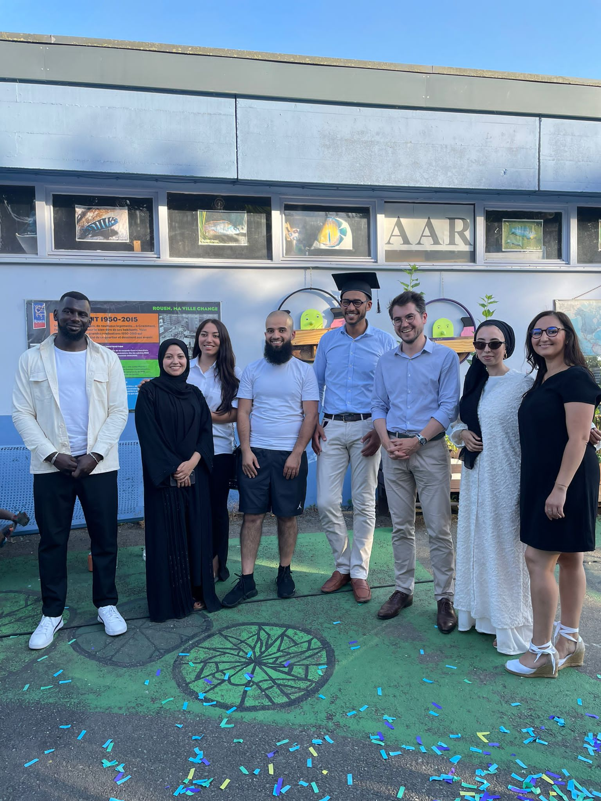
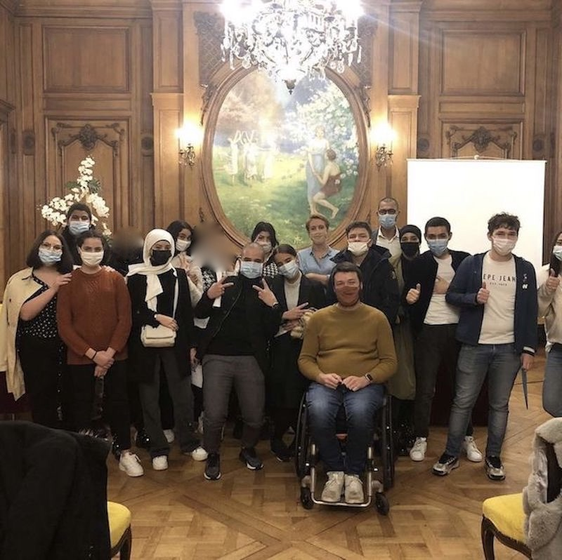
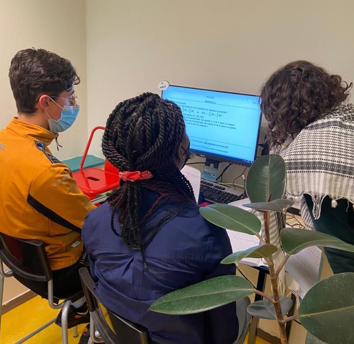
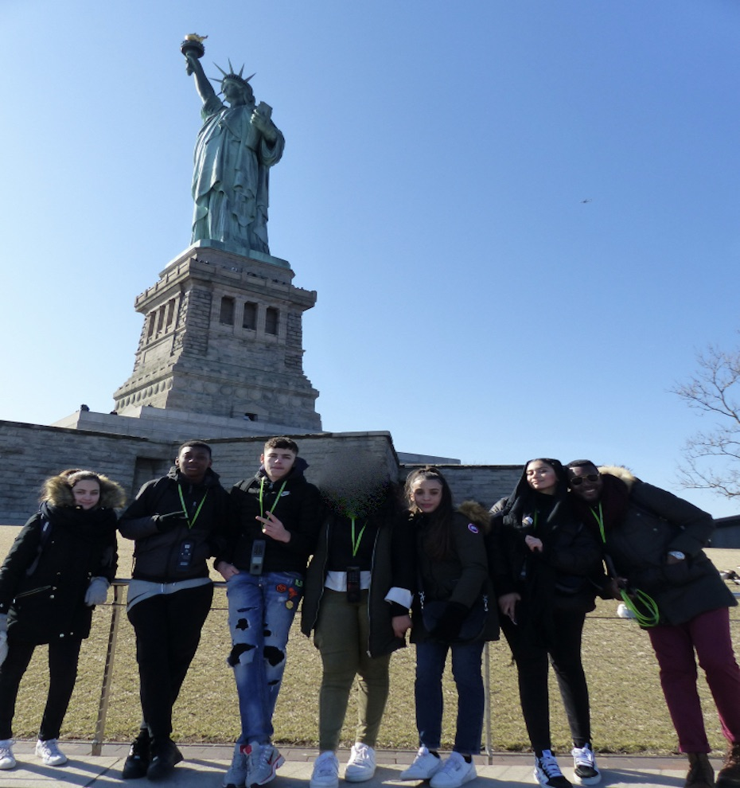
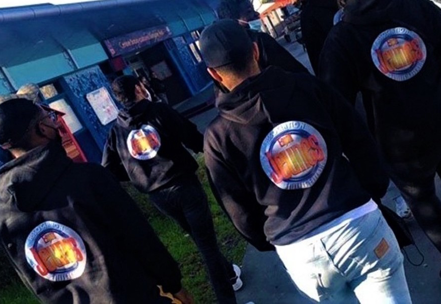
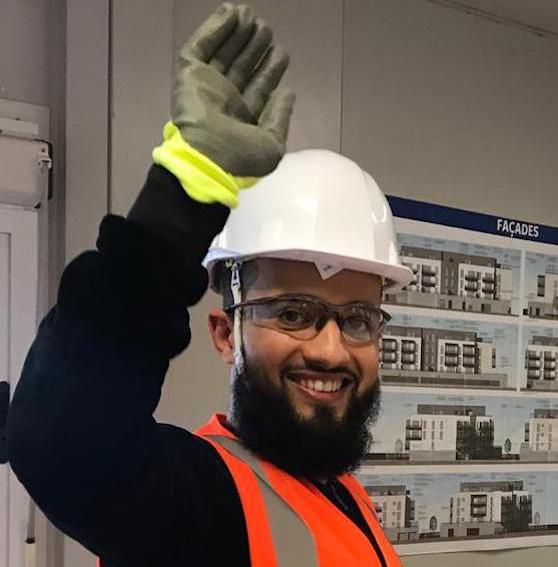
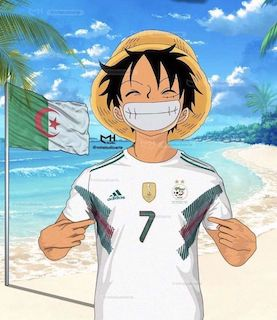
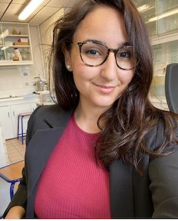

-- Espoir jeunes explication site web

index.html
```
  <section class="section section-lg section-main-bunner section-main-bunner-filter">
    <div class="main-bunner-img" style="background-image: url(&quot;images/maroc2.jpeg&quot;); background-size: cover;">
    </div>
    <div class="main-bunner-inner">
      <div class="container">
        <div class="row row-50 justify-content-lg-center align-items-lg-center">
          <div class="col-lg-36">
            <article class="quote-primary">
              <div class="quote-primary-body">
                <div class="quote-primary-text">
                  <br><br><br><br>
                  <p class="q">"RIEN N’EST TROP DIFFICILE POUR LA JEUNESSE"</p>
                </div>
              </div>
              <div class="quote-primary-footer">
                <div class="bg-dot"></div>
                <p class="quote-primary-cite">Socrate</p>
              </div>
            </article>
          </div>
        </div>
      </div>
    </div>
  </section>
```
Ce code représente une section qui affiche une image en arrière-plan (définie par le style inline) et un contenu textuel centré verticalement sur l'image.

Plus précisément, la section a une classe "section-lg section-main-bunner section-main-bunner-filter" qui est utilisée pour définir la mise en forme de la section. La classe "main-bunner-img" est utilisée pour définir l'image de fond, et la classe "main-bunner-inner" est utilisée pour centrer le contenu textuel.

Le contenu textuel est défini dans un article de classe "quote-primary" qui contient un élément de citation avec une classe "quote-primary-text" qui contient la citation elle-même et un élément de citation avec une classe "quote-primary-cite" qui contient l'auteur de la citation. Il y a également un petit élément décoratif sous l'auteur avec une classe "bg-dot".

```
  <section class="section section-xl">
    <div class="container">
      <h1 class="text-center box-icon-inner decorate-triangle"> 🕵🏻‍♂️Nos Missions <span
          class="text-strike">Impossibles</span> 🎯</h1>
      <div style="text-align: center;">
        <span> Dites bien à Tom Cruise de retourner faire la vaiselle, içi toutes les missions sont possibles 💥 </span>
      </div>
      <div class="row row-50 justify-content-lg-between align-items-lg-center">
        <div class="col-sm">
          <div class="box-img-animate">
            <div class="box-img-animate-item"
              data-parallax-scroll="{&quot;y&quot;: 0, &quot;x&quot;: 50,  &quot;smoothness&quot;: 50 }"></div>
            <div class="box-img-animate-item"
              data-parallax-scroll="{&quot;y&quot;: 150, &quot;x&quot;: 0,  &quot;smoothness&quot;: 50 }"></div>
            <div class="box-img-animate-item"
              data-parallax-scroll="{&quot;y&quot;:0, &quot;x&quot;: 140,  &quot;smoothness&quot;: 50 }"></div>
            <div class="box-img-animate-item"
              data-parallax-scroll="{&quot;y&quot;:20, &quot;x&quot;: 20,  &quot;smoothness&quot;: 50 }"></div>
            <div class="box-img-animate-item"
              data-parallax-scroll="{&quot;y&quot;:60, &quot;x&quot;: 70,  &quot;smoothness&quot;: 50 }"></div>
            <div class="box-img-animate-item"
              data-parallax-scroll="{&quot;y&quot;:0, &quot;x&quot;: 180,  &quot;smoothness&quot;: 60 }"></div>
          </div>
        </div>
        <div class="col-sm">
          <div class="box-img-animate">
            <div class="box-img-animate-item"
              data-parallax-scroll="{&quot;y&quot;:70, &quot;x&quot;: -50,  &quot;smoothness&quot;: 50 }"></div>
            <div class="box-img-animate-item"
              data-parallax-scroll="{&quot;y&quot;:-90, &quot;x&quot;: -100,  &quot;smoothness&quot;: 50 }"></div>
            <div class="box-img-animate-item"
              data-parallax-scroll="{&quot;y&quot;:160, &quot;x&quot;: -70,  &quot;smoothness&quot;: 50 }"></div>
            <div class="box-img-animate-item"
              data-parallax-scroll="{&quot;y&quot;:70, &quot;x&quot;: -50,  &quot;smoothness&quot;: 50 }"></div>
            <div class="box-img-animate-item"
              data-parallax-scroll="{&quot;y&quot;: 0, &quot;x&quot;: -70,  &quot;smoothness&quot;: 50 }"></div>
            <div class="box-img-animate-item"
              data-parallax-scroll="{&quot;y&quot;: -50, &quot;x&quot;: -100,  &quot;smoothness&quot;: 50 }"></div>
            <div class="box-img-animate-item"
              data-parallax-scroll="{&quot;y&quot;: -50, &quot;x&quot;: -100,  &quot;smoothness&quot;: 50 }"></div>
          </div>
        </div>
      </div>
    </div>
  </section>
```
Ce code HTML crée une section avec une grande image animée et deux colonnes avec des images plus petites.

La section est définie avec la classe "section section-xl". À l'intérieur de la section, il y a une div avec la classe "container" qui contient le contenu principal. Le titre "Nos Missions Impossibles" est ajouté à l'aide de la balise h1 et la classe "text-center box-icon-inner decorate-triangle". Le texte "Dites bien à Tom Cruise de retourner faire la vaiselle, içi toutes les missions sont possibles" est ajouté avec une div avec une classe de style "text-align: center;".

Les deux colonnes sont créées avec la classe "row row-50 justify-content-lg-between align-items-lg-center". Chacune des colonnes contient une div avec la classe "box-img-animate" qui affiche une image animée. Chaque image est contenue dans une div avec la classe "box-img-animate-item" et des propriétés spéciales sont ajoutées pour animer chaque image de manière unique en utilisant l'attribut "data-parallax-scroll". Les images sont stockées dans des fichiers JPG et référencées à l'aide de la balise img avec une source attribuée à l'attribut src.

```
  <section class="section section-lg bg-gray-1">
    <div class="container">
      <div class="row justify-content-center text-center">
        <div class="col-sm wow-outer">
          <div class="wow slideInDown">
            <div class="box-icon-inner decorate-circle"></div>
            <h1>Nos derniers projets</h1>
            <div style="text-align: center;">
              <span> "Une tête pleine de projets est une tête vide de présent" 🙊<br>T'as vu la bête de phrase ???
              </span>
            </div>
          </div>
        </div>
      </div>
      <div class="row row-50">
        <div class="col-sm wow-outer">
          <div class="wow fadeInUp">
            <article class="box-causes">
              <div class="box-causes-img">
              </div>
              <h4 class="font-weight-medium"><a href="//www.instagram.com/wheeled_world/">Wheeled World</a></h4>
              <p> Rencontre avec <a href="//www.instagram.com/wheeled_world/">@wheeled_world</a>
              </p>
            </article>
          </div>
        </div>
        <div class="col-sm wow-outer">
          <div class="wow fadeInUp">
            <article class="box-causes">
              <div class="box-causes-img "><br>
                
              </div>
              <h4 class="font-weight-medium"><br><a href="#">Projet Franco-Américain</a></h4>
              <p>"Liberté, égalité, citizenship"
              </p>
            </article>
          </div>
        </div>
        <div class="col-sm wow-outer">
          <div class="wow fadeInUp">
            <article class="box-causes">
              <div class="box-causes-img">
                
              </div>
              <h4 class="font-weight-medium"><a href="#">Distribution de kit sanitaire </a></h4>
              <p>(gel hydroalcoolique, savon, masques...)
              </p>
            </article>
          </div>
        </div>
      </div>
    </div>
  </section>
```
Ce code HTML crée une section avec une grande image animée et deux colonnes avec des images plus petites.

La section est définie avec la classe "section section-xl". À l'intérieur de la section, il y a une div avec la classe "container" qui contient le contenu principal. Le titre "Nos Missions Impossibles" est ajouté à l'aide de la balise h1 et la classe "text-center box-icon-inner decorate-triangle". Le texte "Dites bien à Tom Cruise de retourner faire la vaiselle, içi toutes les missions sont possibles" est ajouté avec une div avec une classe de style "text-align: center;".

Les deux colonnes sont créées avec la classe "row row-50 justify-content-lg-between align-items-lg-center". Chacune des colonnes contient une div avec la classe "box-img-animate" qui affiche une image animée. Chaque image est contenue dans une div avec la classe "box-img-animate-item" et des propriétés spéciales sont ajoutées pour animer chaque image de manière unique en utilisant l'attribut "data-parallax-scroll". Les images sont stockées dans des fichiers JPG et référencées à l'aide de la balise img avec une source attribuée à l'attribut src.

```
<section class="section section-lg bg-gray-1">
    <div class="container">
      <div class="box-icon-inner decorate-circle"></div>
      <h3 class="text-center">🦅 Nos Partenaires 🐌</h3>
      <div style="text-align: center;">
        <span> Sans eux je pense que l'association aurait déjà mis clés sous la porte🚪. <br> Merci infiniment on vous
          aime
          🤍 (coeur sur vous)</span>
      </div>
      <div class="row row-50 justify-content-lg-between align-items-lg-center">
        <div class="col-sm">
          <div class="box-icon-modern">
            <div class="box-icon-inner">
              
            </div>
          </div>
        </div>
        <div class="col-sm">
          <div class="box-icon-modern">
            <div class="box-icon-inner">
              
            </div>
          </div>
        </div>
        <div class="col-sm">
          <div class="box-icon-modern">
            <div class="box-icon-inner">
              
            </div>
          </div>
        </div>
        <div class="col-sm">
          <div class="box-icon-modern">
            <div class="box-icon-inner">
              
            </div>
          </div>
        </div>
      </div>
    </div>
    </div>
  </section>
```

Ce code est une section HTML qui affiche des partenaires de l'association.

La section a une classe "section-lg" et une couleur de fond "bg-gray-1". Elle contient une boîte décorative de forme circulaire et un titre centré "Nos Partenaires". En dessous, il y a un texte de remerciement pour les partenaires.

La section est divisée en quatre colonnes, chacune contenant une boîte de forme carrée contenant une image de logo de l'un des partenaires (Métropole, BNP, Rouen et Normandie).

L'image de chaque partenaire est redimensionnée pour s'adapter à la taille de la boîte.

En général, ce code est utilisé pour montrer des partenaires qui soutiennent l'association et aider à la crédibilité et la visibilité de l'association.

-- projet.html
```
<!DOCTYPE html>
<html class="wide wow-animation" lang="fr">

<head>
  <title>Home - Espoir Jeunes</title>
  <meta charset="utf-8">
  <meta name="viewport" content="width=device-width, height=device-height, initial-scale=1.0">
  <meta http-equiv="X-UA-Compatible" content="IE=edge">
  <link rel="icon" href="images/logo2022.png" type="image/x-icon">
  <link rel="stylesheet" href="css/bootstrap.css">
  <link rel="stylesheet" href="css/fonts.css">
  <link rel="stylesheet" href="css/style.css">
  </head>
  ```

Dans le head il y a le titre du site et l'appel aux différents css, le css boostrap, le css basique le style,

````
.ie-panel {
      display: none;
      background: #ffffff5b;
      padding: 10px 0;
      box-shadow: 3px 3px 5px 0 rgba(0, 0, 0, .3);
      clear: both;
      text-align: center;
      position: relative;
      z-index: 1;
    }

    html.ie-10 .ie-panel,
    html.lt-ie-10 .ie-panel {
      display: block;
    }
````
Ce code CSS sert à afficher un message d'avertissement pour les navigateurs Internet Explorer (IE) obsolètes.

Le bloc de code déclare une classe CSS nommée .ie-panel qui définit les propriétés de style pour le message d'avertissement. Le code utilise la propriété display: none pour cacher le message par défaut et display: block pour l'afficher uniquement sur les versions obsolètes de Internet Explorer.

Les navigateurs plus récents et compatibles avec les normes web ne verront pas ce message d'avertissement car ils ne correspondent pas aux conditions spécifiées dans le code (à savoir, les versions de IE inférieures à 10).

En somme, ce code permet de fournir une expérience utilisateur optimale en avertissant les utilisateurs de navigateurs obsolètes qu'ils peuvent rencontrer des problèmes d'affichage et en leur suggérant de mettre à jour leur navigateur.

```
<body>
  <!-- Page Header-->
  <header class="section page-header">
    <!-- RD Navbar-->
    <div class="rd-navbar-wrap">
      <nav class="rd-navbar rd-navbar-classic" data-layout="rd-navbar-fixed" data-sm-layout="rd-navbar-fixed"
        data-md-layout="rd-navbar-fixed" data-md-device-layout="rd-navbar-fixed" data-lg-layout="rd-navbar-static"
        data-lg-device-layout="rd-navbar-static" data-xl-layout="rd-navbar-static"
        data-xl-device-layout="rd-navbar-static" data-xxl-layout="rd-navbar-static"
        data-xxl-device-layout="rd-navbar-static" data-lg-stick-up-offset="46px" data-xl-stick-up-offset="46px"
        data-xxl-stick-up-offset="46px" data-lg-stick-up="true" data-xl-stick-up="true" data-xxl-stick-up="true">
        <div class="rd-navbar-main-outer">
          <div class="rd-navbar-main">
            <!-- RD Navbar Panel-->
            <div class="rd-navbar-panel">
              <!-- RD Navbar Toggle-->
              <button class="rd-navbar-toggle" data-rd-navbar-toggle=".rd-navbar-nav-wrap"><span></span></button>
              <!-- RD Navbar Brand-->
              <div class="breadcrumbs-custom-title">
                <div>
                  <h2 class="heading-font text-accent-2"> &ensp;Espoir Jeunes </h2>
                </div>
              </div>
            </div>
            <div class="rd-navbar-main-element">
              <div class="rd-navbar-nav-wrap">
                <!-- RD Navbar Nav-->
                <ul class="rd-navbar-nav">
                  <li class="rd-nav-item"><a class="rd-nav-link" href="index.html">Home</a>
                  </li>
                  <li class="rd-nav-item"><a class="rd-nav-link" href="about-us.html">About Us</a>
                  </li>
                  <li class="rd-nav-item active"><a class="rd-nav-link" href="projets.html">Projets</a>
                  </li>
                  <li class="rd-nav-item"><a class="rd-nav-link" href="contacts.html">Contacts</a>
                  </li>
                  <li class="rd-nav-item">
                    <form action="https://www.paypal.com/donate" method="post" target="_top">
                      <input type="hidden" name="hosted_button_id" value="3E8ZCUNYY5PZA" />
                      <input type="image" src="https://www.paypalobjects.com/fr_FR/FR/i/btn/btn_donateCC_LG.gif"
                        border="0" name="submit" title="PayPal - The safer, easier way to pay online!"
                        alt="Bouton Faites un don avec PayPal" />
                      
                    </form>
                  </li>
                </ul>
              </div>
            </div>
          </div>
        </div>
      </nav>
    </div>
  </header>
```
Ce code correspond à l'en-tête (header) d'une page web. Il contient un menu de navigation (nav) qui permet aux utilisateurs de naviguer vers différentes pages du site web. Le menu de navigation est créé à l'aide de la bibliothèque JavaScript "RD Navbar". Le logo et le nom du site web sont également affichés dans l'en-tête. Il y a également un bouton de don PayPal intégré dans le menu de navigation.
````

<section class="parallax-container" data-parallax-img="images/adherents2.jpeg">
    <div class="parallax-content breadcrumbs-custom context-dark">
      <div class="container">
        <div class="row justify-content-center">
          <div class="col-12 col-lg-9">
            <h2 class="breadcrumbs-custom-title">Projets</h2>
            <ul class="breadcrumbs-custom-path">
              <li><a href="index.html">Home</a></li>
              <li><a href="about-us.html">About Us</a></li>
              <li class="active">Projets</li>
              <li><a href="contacts.html">Contacts</a></li>
            </ul>
          </div>
        </div>
      </div>
    </div>
  </section>
  <!-- Base typography -->
  <section class="section section-lg bg-green-1 bg-green-1-decor">
    <div class="container">
      <div class="row row-50">
        <div class="col-sm">
          <h3>🎊 [💬 Concours d’éloquence #EspoirJeunes]</h3>
          <div class="text-with-divider">
            <div class="divider"></div>
            <h4 class="text-opacity-70">Acte 1, scène 2 : “Parlez-moi de vous, les quarts de finale”<br></h4>
          </div>
          <ul class="list-marked">
            <p>👏 Un grand bravo à tous les qualifiés du premier tour:
              Jamila, Syrine, Yasmina, Louise, Mouhamed-Amine, Ranya
            </p>
            <p>
              Un grand merci aussi à notre jury : Adrien NAIZET, Zakia SEINTIGNAN, Marine NATIVELLE. </p>

            <p>Deuxième épisode encore plus prodigieux que le précédent. À l'issue de ces battles, et au terme d'une
              délibération commune, le jury a désigné les grands qualifiés du Concours d'Éloquence pour la
              demi-finale:<br>

              <br>Ranya (Lycéenne en Terminale générale, section internationale espagnole)
              <br>Louise (Étudiante en L1 de psycho)
              <br>Mouhamed-Amine (Lycéen en Terminale générale)<br>

              <br>Voici les différents sujets que les candidats ont dû traiter :
            </p>
            <ul class="list-marked">
              <li> « Qui veut la paix prépare la guerre »☄️</li>
              <li> « La laïcité est intolérante »⛔️</li>
              <li>« La liberté d’expression de l’un s’arrête là où commencent les intérêts de l’autre »🕊</li>
            </ul>
            </p>
          </ul>
        </div>
        <div class="col-lg-6 pr-xl-5">
          <video controls>
            <source src="images/eloq_vid.mp4" controls width="640" height="360" type="video/mp4">
            Your browser does not support the video tag.
          </video>
        </div>
      </div>
    </div>
  </section>
````

Ce code correspond à la section de la page qui contient l'en-tête (header) du site. Plus précisément, il s'agit d'une barre de navigation (nav) qui utilise le framework RD Navbar. Elle est composée d'une div pour envelopper le RD Navbar, d'une autre div pour le RD Navbar Panel, qui contient le RD Navbar Toggle (bouton pour ouvrir ou fermer le menu) et le RD Navbar Brand (titre du site), et d'une troisième div pour le RD Navbar Nav, qui contient les différents liens du menu.

Les liens du menu sont représentés par des balises <li> (listes) et les titres des liens par des balises <a> (ancre). Les liens mènent aux différentes pages du site : Home, About Us, Projets et Contacts. Il y a également un dernier lien qui contient un formulaire pour faire un don via PayPal.

````
 <section class="section section-lg bg-default">
    <div class="container">
      <div class="row row-50">
        <div class="col-sm pr-xl-5">
        </div>
        <div class="col-sm">
          <h3>[💬 Concours d’éloquence]</h3>
          <div class="text-with-divider">
            <div class="divider"></div>
            <h4 class="text-opacity-70">Chapitre 1, scène 1 : “Parlez moi de vous, les qualifications”<br></h4>
          </div>
          <ul class="list-marked">
            <p>👏 Un grand bravo à tous les participants de cette première édition :
              Jamila, Syrine, Léa, Jean, Cirine, Hosanna, Yasmina, Louise, Ambre, Janat, Mouhamed Amine, Ranya ❤️
              👏 Un grand merci aussi à notre magnifique jury : Abdelkrim Marchani, Rayan Hamouda et Adama Tandia 🤍
            </p>
            <p>
              Les concours d’éloquence ont beaucoup de vertus. En effet, ils permettent d’apprendre à gérer son stress
              et à aborder l’oral d’une autre manière 📢. C’est l’art de maîtriser sa pensée 💭d’émouvoir et de
              persuader. C’est donc un bon exercice pour nos jeunes étudiants.

              Voici un petit aperçu de quelques sujets que les candidats ont été amenés à traiter :
            <ul class="list-marked">
              <li>En faut-il peu pour être heureux 🤗? </li>
              <li>La misère est elle moins pénible au soleil ☀️? </li>
              <li>Ce n'est pas le doute qui rend fou : c'est la certitude 🤪</li>
              <li>N'est-il pas temps d'arrêter le progrès 🚀? </li>
              <li>L'homme est il un loup pour l'homme 🐺? </li>
              <li>L'homme naît bon c'est la société qui le corrompt ⚔️?</li>
            </ul>
            </p>
          </ul>
        </div>
      </div>
    </div>
  </section>
````

Ce code est une section HTML qui utilise la classe "section-lg bg-default" pour définir un élément de section avec un fond par défaut (bg-default). À l'intérieur de cette section, il y a un conteneur (div class="container") qui contient une rangée (div class="row row-50"). Cette rangée est composée de deux colonnes (div class="col-sm"), dont l'une contient une image (img src="images/cc2 eloquence.jpeg") avec une largeur de 518 pixels et une hauteur de 430 pixels, tandis que l'autre contient un titre (h3) et du texte en utilisant des balises de liste (ul, li).

Le titre est "[💬 Concours d’éloquence]" et le texte inclut des informations sur les participants, les membres du jury, ainsi que des réflexions sur les concours d'éloquence et une liste de sujets qui ont été traités pendant la compétition. La mise en forme utilise des classes pour ajouter des styles spécifiques tels que pr-xl-5, text-opacity-70, list-marked, etc.

```
<section> 
    <div class="container">
      <div class="row row-50">
        <div class="col-sm">
          <h3>🎊 CÉRÉMONIE DES JEUNES DIPLÔMÉS 👩‍🎓👨‍🎓 - Juillet 2022</h3>
          <div class="text-with-divider">
            <div class="divider"></div>
            <h4 class="text-opacity-70"><br></h4>
          </div>
          <ul class="list-marked">
            <p>Cérémonie de remise des diplômes Espoir Jeunes : 8 Jeunes mis à l'honneur ❤ <br> <br>

              Mercredi soir 13/07/2022, 8 jeunes ont été mis à l'honneur. Ces derniers ont en effet reçu le diplôme du
              mérite Espoir Jeunes attestant leur réussite aux épreuves du Brevet (1 Jeune) et du Baccalauréat (7
              Jeunes). 👏👏
              La métropole de Rouen et la ville de Rouen ont tenu à féliciter tous les nouveaux diplômés de
              l'association Espoir Jeunes à l'occasion de la cérémonie en présence de Adrien Naizet et de Abdelkrim
              Marchani, le 14/07/2022. 🎉</p>
          </ul>
        </div>
        <div class="col-lg-6 pr-xl-5">
        </div>
      </div>
    </div>
  </section>
```

Le code HTML contient des informations sur une cérémonie de remise des diplômes. La section a une classe "section-lg bg-green-1 bg-green-1-decor", ce qui signifie qu'elle a une taille de police et une couleur de fond spécifiques. Il y a deux colonnes à l'intérieur de la section, une avec une image et une autre avec du texte. Le texte décrit la cérémonie et les diplômés honorés, y compris leur réussite aux épreuves du Brevet et du Baccalauréat. Il y a également une liste à puces et une image de confettis.

````
 <section class="section section-lg bg-default">
    <div class="container">
      <div class="row row-50">
        <div class="col-sm pr-xl-5">
        </div>
        <div class="col-sm">
          <h3>PROJET GREEN'MONT</h3>
          <div class="text-with-divider">
            <div class="divider"></div>
            <h4 class="text-opacity-70"><br></h4>
          </div>
          <ul class="list-marked">
            <li>Se saisir des problématiques environnementales sur le territoire.</li>
            <li>Sensibiliser les jeunes à la question de l'environnement.</li>
            <li>Les habitants des quartiers sont souvent éloignés de ces questions écologiques mais le but est de faire
              prendre conscience aux jeunes qu'ils sont de véritables acteurs.</li>
            <li>Pour ce faire, nous sommes allés à la rencontre de différents professionnels sur les questions de
              l’environnement à travers quatre thématiques.</li>
            <br>
            Les quatre thématiques sont les suivantes :
            <li>Tri, Recyclage</li>
            <li>Sensibilisation aux gestes environnementales à la maison</li>
            <li>Manger sain, bio et locale</li>
            <li>Le réchauffement climatique et ses conséquences</li>
          </ul>
        </div>
      </div>
    </div>
  </section>
  <section class="section section-lg bg-green-1 bg-green-1-decor">
    <div class="container">
      <div class="row row-50">
        <div class="col-sm">
          <h3>CLAS 2022 (Contrat Local d'Accompagnement à la Scolarité)</h3>
          <div class="text-with-divider">
            <div class="divider"></div>
            <h4 class="text-opacity-70"><br></h4>
          </div>
          <ul class="list-marked">
            <li>Réintroduire les parents dans la scolarité de leur enfant</li>
            <li>Accompagner à l'aide aux devoirs</li>
            <li>Permettre aux jeunes de s'épanouir et d'aborder la question des devoirs de manière différente
              (illustrations, jeux ludiques..)</li>
            <li>Pour ce faire, nous sommes allés à la rencontre de différents professionnels sur les questions de
              l’environnement à travers quatre thématiques.</li><br>
            Pousser à l'ouverture d'esprit et au développement personnel via différents leviers :
            <li>sensibilisation aux outils du numérique</li>
            <li>aux fake news</li>
            <li>à l'environnement</li>
            <li>à la prise de parole et de décision, sous forme de débats.</li>
          </ul>
        </div>
        <div class="col-sm pr-xl-5">
        </div>
      </div>
    </div>
  </section>
````
Ce code HTML représente deux sections distinctes de la page web. La première section a une classe "bg-default" et contient une image sur la gauche et du texte sur la droite. Le texte décrit un projet environnemental appelé "Green'mont" avec des objectifs tels que la sensibilisation des jeunes à l'environnement et la promotion de l'implication des jeunes dans les questions environnementales. Il y a aussi une liste de quatre thématiques liées à l'environnement qui ont été abordées lors du projet.

La deuxième section a une classe "bg-green-1 bg-green-1-decor" et contient une image sur la droite et du texte sur la gauche. Le texte décrit un projet appelé "CLAS 2022" qui vise à réintroduire les parents dans la scolarité de leurs enfants et à offrir un accompagnement aux devoirs pour les jeunes. Il y a aussi une liste de quatre domaines différents de sensibilisation, tels que la sensibilisation aux outils numériques et à la prise de parole.

```
  <section class="section section-lg bg-default">
        <div class="container">
          <div class="row">
            <div class="col-lg-10">
              <h3>HTML Text Elements</h3>
              <p class="text-block">Welcome to our wonderful world. <span class="text-bold">This is a bold text </span>
                <mark>This is a highlighted text</mark>We sincerely hope that each and every user entering our website will find exactly what he/she is looking for. <span>With advanced features of activating account and new login</span><span class="tooltip-custom" data-toggle="tooltip" data-placement="top" title="Tooltips">Tooltips</span><span>widgets, you will definitely have a great experience of using our web page.</span><span class="text-strike">This is a strickethrough text </span><span class="text-underline">This is an underlined text.</span><a class="link-hover" href="#">Hover link</a><a class="link-active" href="#">Press link</a>
              </p>
            </div>
          </div>
        </div>
      </section>
      <!-- Unordered List-->
      <section class="section section-lg bg-default">
        <div class="container">
          <div class="row row-50">
            <div class="col-lg-6">
              <h3>Ordered & Unordered Lists</h3>
              <div class="row row-50">
                <div class="col-sm-6">
                  <ul class="list-marked">
                    <li>High Professionalism</li>
                    <li>Customer Service</li>
                    <li>Innovation</li>
                    <li>Ethics</li>
                    <li>Management</li>
                  </ul>
                </div>
                <div class="col-sm-6">
                  <ol class="list-ordered">
                    <li>High Professionalism</li>
                    <li>Customer Service</li>
                    <li>Innovation</li>
                    <li>Ethics</li>
                    <li>Management</li>
                  </ol>
                </div>
              </div>
            </div>
          </div>
        </div>
      </section>
```
Le code HTML fourni crée deux sections distinctes. La première section a une classe "section section-lg bg-default" et contient une div de classe "container" avec une div de classe "row" à l'intérieur. Cette dernière div contient une div de classe "col-lg-10" qui elle-même contient un titre de niveau 3 (h3) et un paragraphe (p) avec plusieurs éléments de texte différents, y compris des balises de texte en gras (span avec classe "text-bold"), une balise de texte surlignée (mark), une balise de texte barré (span avec classe "text-strike") et une balise de lien (a avec classe "link-hover" et "link-active"). Il y a également une balise de texte (span) avec une classe "tooltip-custom" qui déclenche une infobulle (tooltip) lorsqu'elle est survolée.

La deuxième section a également une classe "section section-lg bg-default" et contient une div de classe "container" avec une div de classe "row" à l'intérieur. Cette dernière div contient une div de classe "col-lg-6" qui contient un titre de niveau 3 (h3) et deux listes, une liste à puces (ul avec classe "list-marked") et une liste ordonnée (ol avec classe "list-ordered"). Les deux listes contiennent des éléments de liste (li) qui ont le même texte pour chaque liste.


# La page contact-us


## page contact
- Fondamentalement, ce code représente 2 sections une qui affiche le numéro de téléphone de l'association, l'adresse et l'eamil de l'association
````
<section class="parallax-container" data-parallax-img="images/adherents.jpeg">
        <div class="parallax-content breadcrumbs-custom context-dark">
          <div class="container">
            <div class="row justify-content-center">
              <div class="col-12 col-lg-9">
                <h2 class="breadcrumbs-custom-title">Contacts</h2>
                <ul class="breadcrumbs-custom-path">
                  <li><a href="index.html">Home</a></li>
                  <li><a href="about-us.html">About Us</a></li>
                  <li><a href="projets.html">Projets</a></li>
                  <li> <class="active">Contacts </li>
                </ul>
              </div>
            </div>
          </div>
        </div>
      </section>
      <section class="section section-lg text-center bg-default">
        <div class="container">
          <div class="row row-50">
            <div class="col-md-6 col-lg-4">
              <div class="box-icon-classic">
                <div class="box-icon-inner decorate-triangle decorate-color-secondary"><span class="icon-xl linearicons-phone-incoming icon-gradient-1"></span></div>
                <div class="box-icon-caption">
                  <h4><a href="tel:#"> 06.51.46.84.74</a></h4>
                  <p>Appelez-nous, on répond plus vite que la SNCF</p>
                </div>
              </div>
            </div>
            <div class="col-md-6 col-lg-4">
              <div class="box-icon-classic">
                <div class="box-icon-inner decorate-circle decorate-color-secondary-2"><span class="icon-xl linearicons-map2 icon-gradient-2"></span></div>
                <div class="box-icon-caption">
                  <h4><a href="https://goo.gl/maps/gT9qkJFUfgj9Rr3XA">31 Rue de la Cité Jardin, Rouen, 76100 Rouen, France</a></h4>
                  <p>Venez nous rendre visite, mais ne venez pas nous braquer s'il vous plaît (🥲)<br> Merci !</p>
                </div>
              </div>
            </div>
            <div class="col-md-6 col-lg-4">
              <div class="box-icon-classic">
                <div class="box-icon-innefr decorate-rectangle decorate-color-primary"><span class="icon-xl linearicons-paper-plane icon-gradient-3"></span></div>
                <div class="box-icon-caption">
                  <h4><a href="mailto:yachour1@icloud.com ">espoir.jeunes@yahoo.fr </a></h4>
                  <p>C'est avec grand plaisir qu'on répondra à vos questions</p>
                </div>
              </div>
            </div>
          </div>
        </div>
      </section>
````


## La page About Us

- Ce code représente d'un côté un logo d'association et un texte qui décrit ce que l'association a été fondée et ce qu'elle fait
````
<section class="parallax-container" data-parallax-img="images/adherents.jpeg">
        <div class="parallax-content breadcrumbs-custom context-dark">
          <div class="container">
            <div class="row justify-content-center">
              <div class="col-12 col-lg-9">
                <h2 class="breadcrumbs-custom-title">Contacts</h2>
                <ul class="breadcrumbs-custom-path">
                  <li><a href="index.html">Home</a></li>
                  <li><a href="about-us.html">About Us</a></li>
                  <li><a href="projets.html">Projets</a></li>
                  <li> <class="active">Contacts </li>
                </ul>
              </div>
            </div>
          </div>
        </div>
      </section>
      <section class="section section-lg text-center bg-default">
        <div class="container">
          <div class="row row-50">
            <div class="col-md-6 col-lg-4">
              <div class="box-icon-classic">
                <div class="box-icon-inner decorate-triangle decorate-color-secondary"><span class="icon-xl linearicons-phone-incoming icon-gradient-1"></span></div>
                <div class="box-icon-caption">
                  <h4><a href="tel:#"> 06.51.46.84.74</a></h4>
                  <p>Appelez-nous, on répond plus vite que la SNCF</p>
                </div>
              </div>
            </div>
            <div class="col-md-6 col-lg-4">
              <div class="box-icon-classic">
                <div class="box-icon-inner decorate-circle decorate-color-secondary-2"><span class="icon-xl linearicons-map2 icon-gradient-2"></span></div>
                <div class="box-icon-caption">
                  <h4><a href="https://goo.gl/maps/gT9qkJFUfgj9Rr3XA">31 Rue de la Cité Jardin, Rouen, 76100 Rouen, France</a></h4>
                  <p>Venez nous rendre visite, mais ne venez pas nous braquer s'il vous plaît (🥲)<br> Merci !</p>
                </div>
              </div>
            </div>
            <div class="col-md-6 col-lg-4">
              <div class="box-icon-classic">
                <div class="box-icon-innefr decorate-rectangle decorate-color-primary"><span class="icon-xl linearicons-paper-plane icon-gradient-3"></span></div>
                <div class="box-icon-caption">
                  <h4><a href="mailto:yachour1@icloud.com ">espoir.jeunes@yahoo.fr </a></h4>
                  <p>C'est avec grand plaisir qu'on répondra à vos questions</p>
                </div>
              </div>
            </div>
          </div>
        </div>
      </section>
````

## section Equipe de l'association
- Ce code représente la section "On parle de nous"
  qui se trouve sur la page "à propos de nous" du site Web de l'association, cette section présente de nombreux problèmes tels que la visibilité, l'espace entre les contenus, la taille différente des images
````
<section class="section section-lg bg-default">
    <div class="container">
      <h3 class="text-center">On parle de nous</h3>
      <h6 class="text-center">Bientôt sur la Lune 🌕🚀!</h6>
      <div class="row row-30 row-md-40 row-xl-60">
        <div class="row no-gutters">
          <div class="col-md-6 col-lg-4">
            <div class="team-classic">
              <div class="team-classic-figure">
                <ul class="team-classic-soc-list">
                  <li><a class="icon icon-md fa-instagram" href="https://www.instagram.com/p/CI3yBqRhtJp/"></a></li>
                  <li><a class="icon icon-md fa-google"
                      href="https://www.anacej.fr/post/decouverte-de-la-citoyennete-outre-atlantique-avec-l-association-espoir-jeunes-de-rouen"></a>
                  </li>
                </ul>
              </div>
              <div class="team-classic-caption">
                <h4><a class="team-name"
                    href="https://www.anacej.fr/post/decouverte-de-la-citoyennete-outre-atlantique-avec-l-association-espoir-jeunes-de-rouen">Prix
                    Anacej 2020</a></h4>
                <p>Découverte de la citoyenneté outre-Atlantique avec l'association Espoir Jeunes de Rouen</p>
              </div>
            </div>
          </div>
          <div class="col-md-6 col-lg-4">
            <div class="team-classic">
              <div class="team-classic-figure">
                <ul class="team-classic-soc-list">
                  <li><a class="icon icon-md fa-instagram" href="https://www.instagram.com/p/CVfiSInF1lp/"></a></li>
                  <li><a class="icon icon-md fa-google"
                      href="https://actu.fr/normandie/rouen_76540/rouen-dans-le-quartier-grammont-cette-association-oeuvre-pour-les-visages-des-banlieues_41089542.html"></a>
                  </li>
                </ul>
              </div>
              <div class="team-classic-caption">
                <h4><a class="team-name"
                    href="https://actu.fr/normandie/rouen_76540/rouen-dans-le-quartier-grammont-cette-association-oeuvre-pour-les-visages-des-banlieues_41089542.html">Projet
                    Green'Mont</a></h4>
                <p>À Rouen, une jeunesse se mobilise pour la planète</p>
              </div>
            </div>
          </div>
          <div class="col-md-6 col-lg-4">
            <div class="team-classic">
              <div class="team-classic-figure">
                <ul class="team-classic-soc-list">
                  <li><a class="icon icon-md fa-instagram" href="https://www.instagram.com/p/CVfiSInF1lp/"></a></li>
                  <li><a class="icon icon-md fa-google"
                      href="https://actu.fr/normandie/rouen_76540/rouen-dans-le-quartier-grammont-cette-association-oeuvre-pour-les-visages-des-banlieues_41089542.html"></a>
                  </li>
                </ul>
              </div>
              <div class="team-classic-caption">
                <h4><a class="team-name"
                    href="https://actu.fr/normandie/rouen_76540/rouen-dans-le-quartier-grammont-cette-association-oeuvre-pour-les-visages-des-banlieues_41089542.html">Lauréat
                    de la bourse Tremplin à Rouen </a></h4>
                <p>Rouen. Dans le quartier Grammont, cette association œuvre pour "les visages des banlieues"</p>
              </div>
            </div>
          </div>
        </div>
      </div>
    </div>
  </section>
````


## section "our team"

- Ce code représente la section "notre équipe" sur la page "à propos de nous",qui est l'image et son contenu ci-dessous
  la problématique est similaire à celle ci-dessus qui nécessite également la même modification et peut être un petit changement dans l'aile d'affichage
````
<section class="section section-lg bg-default">
    <div class="container">
      <h1 class="text-center">Our Team 🫂</h1><br>
      <h5 class="text-center">On commence par le président, plus connu sous le nom d 'El Professor'🤓 👨🏼‍🎓! <br></h5>
      <div style="text-align: center;">
        <span>Si on en croît certains mythes, il aurait fait Rouen-Marseille à la nage🏊🏼‍♂️🤿 bon moi j'y crois pas
          trop </span>
      </div>
      <div class="row no-gutters">
        <div class="col-sm">
          <div class="team1-item">
            <div class="team1-img mx-auto">
            </div>
            <div class="">
            </div>
          </div>
        </div>
        <div class="col-sm">
          <div class="team1-item">
            <div class="team1-img mx-auto text-center">
              
            </div>
            <div class="team-classic-caption">
              <h4><a class="team-name" href="#">Yassine Arab</a></h4>
              <p>Fondateur <br>
                Coordinateur social de l’association <br>
                Coordinateur Pôle Solidarité/Mobilité internationale 🌍</p>
            </div>
          </div>
        </div>
        <div class="col-sm">
          <div class="team1-item">
            <div class="team1-img mx-auto">
            </div>
            <div class="">
            </div>
          </div>
        </div>
      </div>

      <br><br>
      <h3 class="text-center">Nos services civiques 2021/2022 !🐯</h3>
      <h5 class="text-center">🤝 La BBC de Rouen #HalaMadrid ❤️ </h5>
      <div style="text-align: center;">
        <span>Sûrment les meilleurs services civiques que l'association ait connu, à la fois drôles, intelligents,
          dynamiques, charmants, altruistes, on trouve tout chez eux ! mais surtout chez le dernier qui est INCROYABLE
          (je ne dis pas ça
          car c'est moi, mais simplemnt il faut savoir dire ce qui est 🦋 #Peace)</span>
      </div>
      <div class="row no-gutters">
        <div class="col-sm">
          <div class="team1-item">
            <div class="team1-img mx-auto text-center">
              
            </div>
            <div class="team-classic-caption">
              <br><br>
              <h4><a class="team-name" href="#">Ghofran Aouiji</a></h4>
              <p>Service civique 2022
                <br> Bénévole
              </p>
            </div>
          </div>
        </div>
        <div class="col-sm">
          <div class="team1-item">
            <div class="team1-img mx-auto text-center">
              
            </div>
            <div class="team-classic-caption">
              <h4><a class="team-name" href="#">Zakaria Tarifit</a></h4>
              <p>Service civique 2022
                <br> Bénévole
              </p>
            </div>
          </div>
        </div>
        <div class="col-sm">
          <div class="team1-item">
            <div class="team1-img mx-auto text-center">
              
            </div>
            <div class="team-classic-caption">
              <h4><a class="team-name" href="#">Yassine Achour</a></h4>
              <p>Service civique 2022
                <br> Bénévole
              </p>
            </div>
          </div>
        </div>
      </div>

      <h3 class="text-center">Nos Coordinateurs ! 🦍</h3>
      <h5 class="text-center"> Les ministres du président, quand le téléphone bip, "Allô" ils sont là 📞 </h5>
      <div style="text-align: center;">
        <span> C'est pas que je les aime pas, mais comme leur nom l'indique c'est des "ministres", ils ne sont jamais
          là, je dois les avoir vu 1 ou 2 fois max,
          l'argent facile, on ne sait plus pour qui voter en 2022 🙈 </span>
      </div>
      <div class="row no-gutters">
        <div class="col-sm">
          <div class="team1-item">
            <div class="team1-img mx-auto text-center">
              
            </div>
            <div class="team-classic-caption">
              <h4><a class="team-name" href="#">Ikram Bechrir </a></h4>
              <p>Coordinatrice Pôle Orientation Scolaire/Insertion Professionnelle
                <br> Bénévole
              </p>
            </div>
          </div>
        </div>
        <div class="col-sm">
          <div class="team1-item">
            <div class="team1-img mx-auto text-center">
              
            </div>
            <div class="team-classic-caption">
              <h4><a class="team-name" href="#">Meriem Henni</a></h4>
              <p>Coordinatrice Pôle Culture/Loisirs
                <br> Bénévole
              </p>
            </div>
          </div>
        </div>
        <div class="col-sm">
          <div class="team1-item">
            <div class="team1-img mx-auto text-center">
              
            </div>
            <div class="team-classic-caption">
              <h4><a class="team-name" href="#">Zina Megueni</a></h4>
              <p> Service civique 2020/2021 <br>
                Coordinatrice Pôle Réussite Éducative <br>
                Bénévole<br>
              </p>
            </div>
          </div>
        </div>
      </div>

      <br><br>
      <h3 class="text-center">Nos bénévoles !🐙</h3>
      <h5 class="text-center">🤝 Toujours disponible pour aider, qu'on aime de tout notre coeur ❤️ </h5>
      <div class="row no-gutters">
        <div class="col-sm">
          <div class="team1-item">
            <div class="team1-img mx-auto text-center">
              
            </div>
            <div class="team-classic-caption">
              <h4><a class="team-name" href="#">Zohra Tlich</a></h4>
              <p>Bénévole</p>
            </div>
          </div>
        </div>
        <div class="col-sm">
          <div class="team1-item">
            <div class="team1-img mx-auto text-center">
              
            </div>
            <div class="team-classic-caption">
              <h4><a class="team-name" href="#">Harouna Tandia</a></h4>
              <p>Bénévole</p>
            </div>
          </div>
        </div>
      </div>
    </div>
  </section>
````


## Footer

- ce code représente une section de pied de page qui contient "footer-minimal-nav" inclut des liens tels que Home,projects,Contact qui se réfère à une courte navigation dans le pied de page,
- donc aussi "col-12" qui consiste en "social-list" qui fait référence à la liste des médias sociaux
- "rights" qui id le droit du site
`````
<footer class="section footer-minimal context-dark">
  <div class="container wow-outer">
    <div class="wow fadeIn">
      <div class="row row-15 row-lg-20">
        <div class="col-12">
          <ul class="footer-minimal-nav">
            <li><a href="index.html">Home</a></li>
            <li><a href="projets.html">Projets</a></li>
            <li><a href="contacts.html">Contacts</a></li>
          </ul>
        </div>
        <div class="col-12">
          <ul class="social-list">
            <li><a class="icon icon-sm icon-circle icon-circle-md icon-bg-white fa-snapchat"
                href="https://t.snapchat.com/WwnLQ8Bb"></a></li>
            <li><a class="icon icon-sm icon-circle icon-circle-md icon-bg-white fa-instagram"
                href="https://www.instagram.com/espoir_jeunes_/"></a></li>
            <li><a class="icon icon-sm icon-circle icon-circle-md icon-bg-white fa-linkedin"
                href="https://www.linkedin.com/company/espoir-jeunes/?challengeId=AQGfUSiJP0auNwAAAYATTRTgZamKG4atMaD36FoX9HF_NtpYfCqB4QMI6Rtjc2yEAUIsjiVIj1A4aQnCKSBMfdjrqLQGgc3SCw&submissionId=a983efd8-8286-e416-d504-964a89df4d28"></a>
            </li>
            <li><a class="icon icon-sm icon-circle icon-circle-md icon-bg-white"
                href="https://www.tiktok.com/@espoir_jeunes_?lang=en"><span class="iconify"
                  data-icon="simple-icons:tiktok" style="color: white;"></span></a></li>
          </ul>
        </div>
      </div>
      <p class="rights"><span>&copy;&nbsp;</span><span
          class="copyright-year"></span><span>&nbsp;</span><span>.&nbsp;</span><span>All Rights
          Reserved.</span><span>&nbsp;</span>Design&nbsp;by&nbsp;<a href="https://www.espoirjeunes.fr/">Espoir
          Jeunes</a></p>
    </div>
  </div>
</footer>
``````

